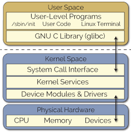

# Enhanced Loadable Kernel Module Tutorial

This little embedded system project tutors how to implement an enhanced led loadable kernel module (LKM) on the BeagleBone Green Wireless (BBGW) board running Debian.

## Introduction

Loadable kernel module (LKM) is a mechanism that can add codes to or remove codes from the Linux kernel at run time.

<p align="center">
    
</p>

## Implementation

The objective is to create a basic LKM that can turn on, off and blink the led (`GPIO49` and `GND`) at the desired intervals.
The implementation is as follows:

-   Download the source code [here](https://github.com/derekmolloy/exploringBB/tree/master/extras/kernel/led).
-   Build the project to create the file `led.ko`:

```sh
sudo su
make
```

-   Install the file `led.ko` to the kernel:

```sh
sudo insmod led.ko
```

-   Interact with the led using these following commands:

```sh
sudo su
echo on > /sys/ebb/led49/mode           # Turn on the led.
echo off > /sys/ebb/led49/mode          # Turn off the led.
echo flash > /sys/ebb/led49/mode        # Blink the led.
echo 100 > /sys/ebb/led49/blinkPeriod   # Change the led blinking period to 100ms.
```

-   Remove the file `led.ko` from the kernel:

```sh
sudo rmmod led
```

-   Read the kernel log:

```sh
tail -f /var/log/kern.log
```

## Explanation

**_In the file `led.c`:_**

-   `ebbLED_init` and `ebbLED_exit` are 2 mandatory functions in every LKMs (`__init` and `__exit`) to add or remove LKMs on the kernel.
-   In `__init`, the kernel object `ebb` is created using the function `kobject_create_and_add()` and is linked to its attributes via the function `sysfs_create_group()`.
-   Initialize GPIOs via APIs with the prefix `gpio_`.
-   Create a kernel thread to run the function `flash()` via the function `kthread_run()`.
-   The function `flash()` is responsible for turning on, off or flashing the led.

**_In the `Makefile`:_**

-   Build the file `led.ko` from the file `led.o`.

## References

-   Writing A Linux Kernel Module Series:
    -   [Part 1: Introduction](https://derekmolloy.ie/writing-a-linux-kernel-module-part-1-introduction/)
    -   [Part 2: A Character Device](https://derekmolloy.ie/writing-a-linux-kernel-module-part-2-a-character-device/)
    -   [Part 3: Buttons And LEDs](http://derekmolloy.ie/kernel-gpio-programming-buttons-and-leds/)
